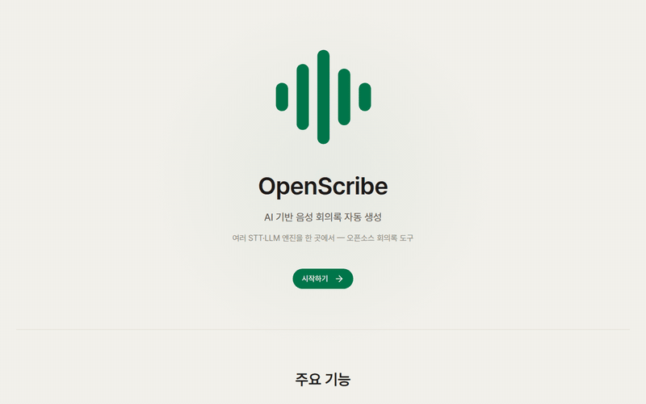

# OpenScribe

한국어 · [English](README.en.md)

회의 음성을 올리면 전사하고, LLM으로 요약·결정사항·액션아이템까지 정리해 주는 회의록 도구입니다.
STT 엔진(Whisper / NVIDIA Riva / NAVER CLOVA)과 요약 모델(로컬 Ollama / OpenAI)을 골라 쓸 수 있습니다.

<p align="center">
  
</p>

<p align="center">
  
</p>

## 주요 기능

- STT 엔진 선택 — Whisper(로컬), NVIDIA Riva, NAVER CLOVA
- 요약 LLM 선택 — 로컬 Ollama(`gemma3:4b` 등) 또는 OpenAI
- pyannote 화자 분리 (선택)
- 전사와 오디오 동기화 — 파형 플레이어, 타임스탬프를 누르면 그 지점부터 재생
- 템플릿 기반 회의록, 체크박스 액션아이템
- PDF / DOCX / Markdown 내보내기

## 구성

- 백엔드 — FastAPI + SQLite (async)
- 프런트엔드 — React + TypeScript + Vite + Tailwind CSS

## 설치 및 실행

Docker와 (가능하면) NVIDIA GPU가 필요합니다.

원클릭으로 띄우려면:

```bash
bash setup.sh
```

GPU를 감지해 전체 스택을 올리고 기본 모델(`gemma3:4b`)까지 받습니다. 끝나면 http://localhost:3000 으로 접속하세요.

직접 실행하려면:

```bash
docker compose up -d --build
docker exec openscribe-ollama ollama pull gemma3:4b   # 요약 모델
```

GPU가 없는 환경:

```bash
docker compose -f docker-compose.yml -f docker-compose.cpu.yml up -d --build
```

하드웨어 요구사항, 상세 설치, 문제 해결은 [docs/INSTALL.md](docs/INSTALL.md)에, 구조 설명은 [docs/SYSTEM.md](docs/SYSTEM.md)에 정리해 두었습니다.

### 요약 모델에 대한 메모

회의록 요약에는 `gemma3:4b`, `qwen2.5`, `llama3.1`, `mistral` 같은 일반 instruct 모델이 잘 맞습니다.
`qwen3`, `deepseek-r1` 같은 추론(thinking) 모델은 답을 내기 전에 오래 "생각"하느라 결과가 비거나 부실하게 나올 수 있어 권장하지 않습니다(선택하면 UI에서 안내합니다).

## 모델·서비스 라이선스

모델과 STT 서버는 저장소에 포함하지 않고 실행 중에 내려받거나 연결합니다. 각각의 라이선스는 사용하는 쪽에서 확인·준수해야 합니다.

- Whisper — OpenAI, MIT
- NVIDIA Riva — NVIDIA 상용 라이선스, [NGC](https://catalog.ngc.nvidia.com/)에서 배포 (선택)
- pyannote — 코드는 MIT, 모델은 게이팅(Hugging Face 토큰 필요)
- Gemma(`gemma3:4b`) — Google [Gemma Terms of Use](https://ai.google.dev/gemma/terms)
- Qwen2.5 / Llama / Mistral 등 — 각 모델 라이선스
- CLOVA Speech — NAVER Cloud 상용 API (선택)

## 라이선스

이 프로젝트의 코드는 MIT 라이선스입니다. [LICENSE](LICENSE) 참고.
© 2026 Jiyoung Choi (최지영)
