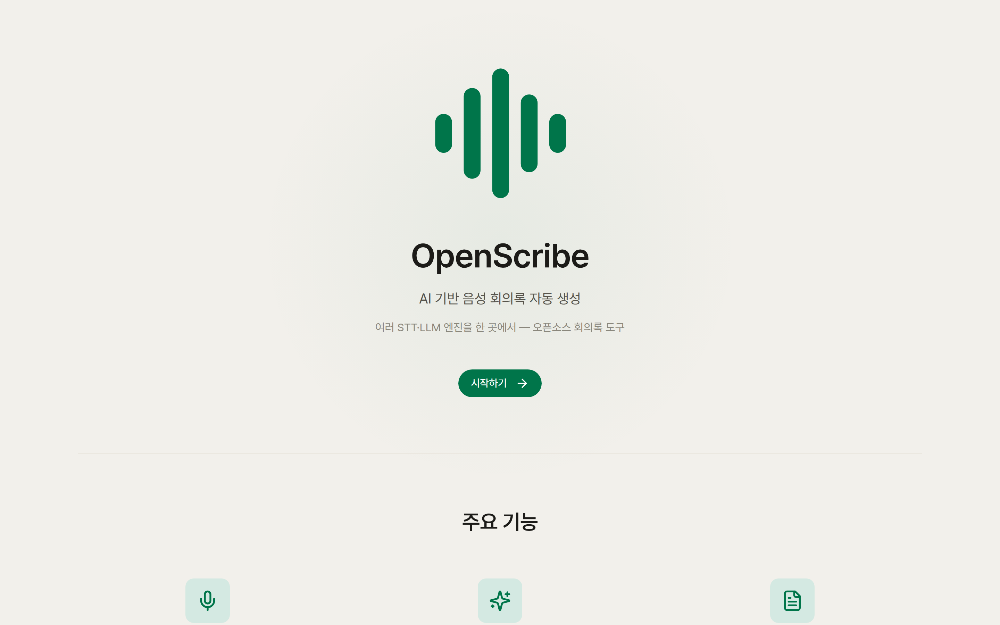
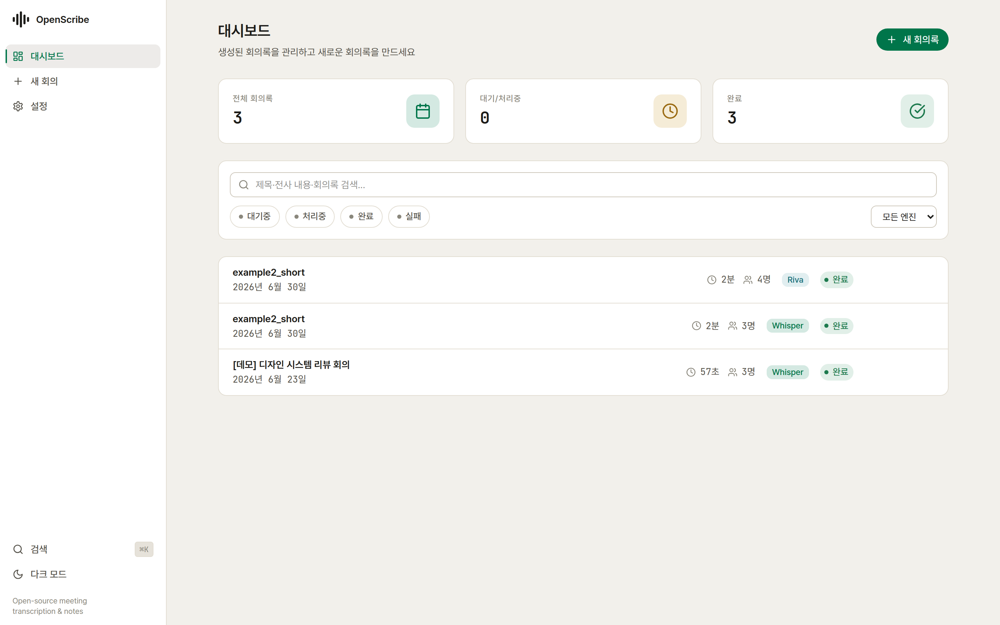
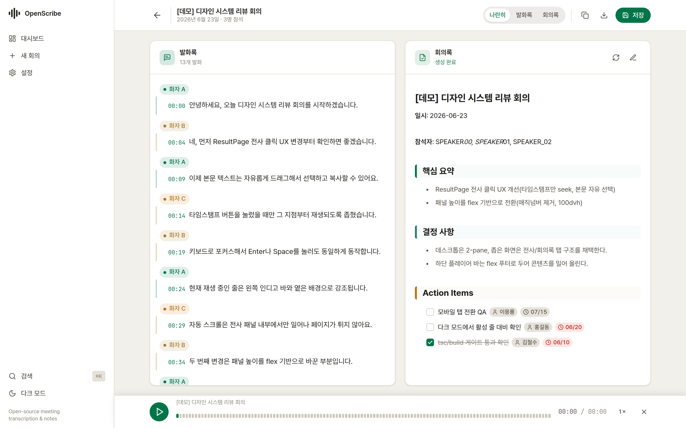
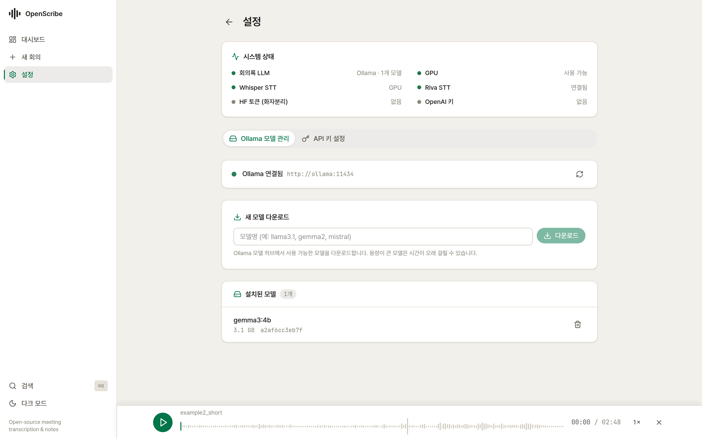

# OpenScribe 시스템 설명서

오픈소스 **AI 회의록 도구**의 구조·구성요소·동작 방식을 설명합니다.
설치는 **[INSTALL.md](INSTALL.md)** 를 참고하세요.

---

## 1. 개요

OpenScribe는 음성 파일을 업로드하면 **전사(STT) → 화자 분리 → 회의록 자동 생성**까지 수행하는 풀스택 웹 애플리케이션입니다. 여러 STT 엔진과 LLM을 자유롭게 선택할 수 있는 것이 특징입니다.

<p align="center"></p>

### 핵심 기능
- **다중 STT 엔진** — Whisper(로컬 GPU/CPU) · NVIDIA Riva · NAVER CLOVA
- **다중 LLM** — 로컬 Ollama(`gemma3:4b` 등) · OpenAI
- **화자 분리** — Whisper+pyannote 또는 Riva diarizer
- **전사 ↔ 오디오 동기화** — 파형 플레이어, 타임스탬프 클릭 재생
- **구조화 회의록** — 템플릿 기반 섹션, 인터랙티브 액션아이템
- **내보내기** — Markdown · PDF · DOCX
- **모던 UI** — 라이트/다크 테마, ⌘K 커맨드 팔레트, 반응형

---

## 2. 아키텍처

```
┌──────────────┐      HTTP/REST       ┌─────────────────────────────┐
│   Frontend   │ ───────────────────▶ │          Backend            │
│ React + Vite │ ◀─────────────────── │     FastAPI (async)         │
│  (nginx)     │                      │  ┌───────────────────────┐  │
└──────────────┘                      │  │ STT 서비스             │  │
                                      │  │  Whisper / Riva / CLOVA│  │
   ┌─────────────────┐  OpenAI호환    │  ├───────────────────────┤  │
   │  Ollama (LLM)   │ ◀────/v1────── │  │ LLM 서비스 (노트 생성) │  │
   │   gemma3:4b …   │                │  ├───────────────────────┤  │
   └─────────────────┘                │  │ Export (MD/PDF/DOCX)  │  │
   ┌─────────────────┐  gRPC :50051   │  └───────────────────────┘  │
   │  Riva ASR 서버   │ ◀───────────── │        SQLite (async)       │
   └─────────────────┘                └─────────────────────────────┘
```

- **Frontend** — React 18 + TypeScript + Vite + Tailwind CSS v4. nginx로 정적 서빙 + `/api` 프록시.
- **Backend** — FastAPI + SQLAlchemy(async) + SQLite. STT/LLM/Export 서비스, 회의·템플릿·설정 API.
- **LLM** — Ollama(또는 OpenAI). 백엔드는 OpenAI 호환 `/v1`로 통신.
- **STT 서버** — Riva는 별도 gRPC 서버, Whisper/CLOVA는 백엔드 내 처리.

배포는 단일 Compose 파일로 구성됩니다:

| 파일 | 역할 |
|---|---|
| `docker-compose.yml` | 전체 스택 (frontend + backend + ollama), GPU |
| `docker-compose.cpu.yml` | GPU 없는 환경용 override (GPU 예약 제거) |

---

## 3. 데이터 흐름

```
오디오 업로드 ──▶ STT 엔진(전사) ──▶ [화자 분리] ──▶ 전사 결과 저장
                                                        │
회의록 내보내기 ◀── 사용자 편집·저장 ◀── LLM 회의록 생성 ◀┘
(MD/PDF/DOCX)                          (템플릿 섹션별)
```

1. **업로드** — 오디오 + 메타(제목/날짜) + 엔진·옵션.
2. **전사(STT)** — 선택 엔진으로 텍스트 + 타임스탬프 생성.
3. **화자 분리(선택)** — 화자별 라벨 부여(화자1/2/3…).
4. **회의록 생성(LLM)** — 템플릿의 각 섹션 프롬프트로 요약/결정/액션아이템 생성.
5. **검토·내보내기** — 화면에서 수정 후 Markdown/PDF/DOCX 저장.

---

## 4. 주요 화면

### 대시보드 — 회의 목록·검색·상태
회의별 엔진(Whisper/Riva), 화자 수, 처리 상태를 한눈에. 제목·전사·회의록 통합 검색과 상태 필터 제공.

<p align="center"></p>

### 결과 — 전사 ↔ 회의록 2-pane
좌측 전사(화자 칩·타임스탬프, 클릭 시 해당 지점 재생) ↔ 우측 구조화 회의록(요약·결정사항·액션아이템). 하단 파형 플레이어로 전사와 동기화.

<p align="center"></p>

### 설정 — 시스템 상태·모델·키
시스템 상태 카드로 엔진/모델/키 준비 상태 확인. Ollama 모델 관리(pull/삭제), API 키 설정.

<p align="center"></p>

---

## 5. 구성요소 상세

### STT 엔진
| 엔진 | 처리 위치 | 화자분리 | 특징 |
|---|---|---|---|
| **Whisper** | 백엔드(GPU/CPU) | pyannote(HF 토큰) | transformers 파이프라인, 다국어 |
| **Riva** | 별도 gRPC 서버 | diarizer 모델 배포 시 | 빠른 한국어 ASR |
| **CLOVA** | NAVER 클라우드 | 지원 | API 키 필요 |

### LLM (회의록 생성)
- OpenAI 호환 `/v1`로 통신 → **Ollama**(로컬) 또는 **OpenAI**.
- 템플릿의 섹션별 프롬프트로 생성. 작은 모델의 폭주를 막는 후처리(정지 토큰·반복 제거) 내장.
- **모델 종류** — 요약엔 일반 instruct 모델(`gemma3:4b`·`qwen2.5` 등)이 적합. **추론(thinking)형**
  (`qwen3`·`deepseek-r1` 등)은 답 전 사고로 토큰을 소진해 빈/부실 응답이 나므로, `/api/llm/models`가
  `reasoning` 플래그로 표시하고 UI가 경고합니다. 빈 응답은 명확한 안내로 실패 처리됩니다.

### 내보내기
- **Markdown** — 클라이언트측 생성.
- **PDF** — WeasyPrint(Markdown→HTML→PDF). 한글 폰트(Noto CJK) 포함 → 한국어 정상 출력.
- **DOCX** — python-docx. (한글 파일명은 RFC 5987로 처리)

---

## 6. 기술 스택

| 영역 | 기술 |
|---|---|
| Frontend | React 18, TypeScript, Vite 6, Tailwind CSS v4, lucide-react |
| Backend | FastAPI, SQLAlchemy(async), aiosqlite, Pydantic |
| STT | transformers(Whisper), pyannote.audio, nvidia-riva-client |
| LLM | OpenAI Python SDK(→ Ollama/OpenAI 호환) |
| Export | WeasyPrint, python-docx, markdown |
| 배포 | Docker, Docker Compose, nginx |

---

## 7. 디렉토리 구조 (요약)

```
openscribe/
├── setup.sh                      # 원클릭 셋업
├── docker-compose.yml            # 전체 스택 (frontend + backend + ollama)
├── docker-compose.cpu.yml        # GPU 없는 환경 override
├── Dockerfile · nginx.conf       # 프런트엔드 이미지
├── src/                          # 프런트엔드(React)
│   ├── components/               #  화면·UI 컴포넌트
│   ├── api/                      #  백엔드 API 클라이언트
│   └── styles/globals.css        #  디자인 토큰
├── backend/
│   └── app/
│       ├── routers/              #  meetings · llm · stt · export · system …
│       ├── services/             #  stt_whisper · stt_riva · llm · notes · export
│       └── models/               #  ORM 모델
└── docs/                         # 설치·시스템 문서(+ 이미지)
```

---

## 8. 라이선스

MIT — 자세한 내용은 루트의 [LICENSE](../LICENSE) 참고. 모델·서드파티 라이선스(Gemma, pyannote, NVIDIA Riva 등) 주의사항은 [README](../README.md)의 "모델·라이선스" 절을 확인하세요.
